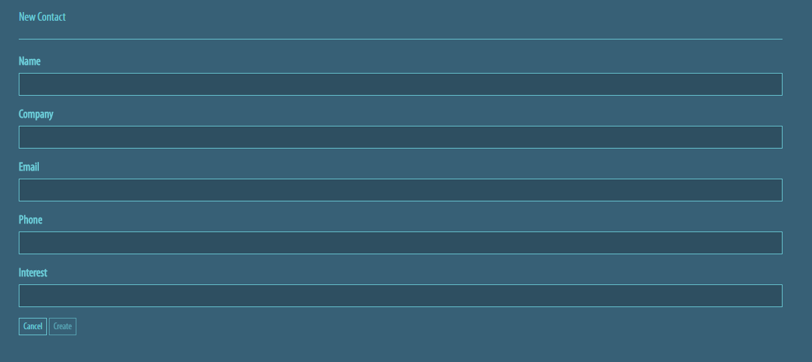
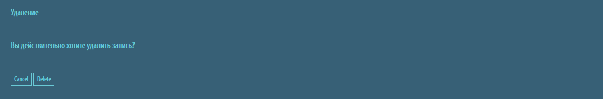

# Тестовое задание

## (24 балла) Обязательная часть.

Сделать Web приложение. Web приложение - сервис, накапливающий информацию о клиентах. Приложение имеет функционал по добавлению нового клиента в базу данных, редактирования и удаления.

Работающий пример доступен по адресу: http://integrationsample.azurewebsites.net/contacts.

Web приложение состоит из нескольких разделов:

- Таблица.
- Форма создания нового контакта.
- Форма редактирования контакта.
- Форма удаления контакта.
- Форма просмотра контакта.

**Таблица**

Таблица содержит все контакты добавленные в базу данных ранее. Это главный вид приложения. Из него можно перейти в другие разделы: создания, редактирования, просмотра и удаления.


**Форма создания нового контакта.**

Дает возможность, заполнив поля формы, добавить новый контакт в базу данных.



**Форма редактирования контакта.**

Эта форма позволяет редактировать уже имеющийся контакт.


**Форма удаления контакта.**

Удаление контакта из базы данных.



**Форма просмотра контакта.**

Содержит детальную информацию о контакте, включая идентификатор записи и внешний ключ.


**Общие требования:**

1. Приложение может быть как одностраничным так и классическим или модулем CMS Bitrix.
2. Язык PHP 5-7.
3. База данных MySQL с одной таблицей "Contacts".
4. Желательно использовать ООП и паттерны проектирования.


## Дополнительные задания.

Дополнительные задания расширяют функционал приложения и не связаны между собой. Дополнительные задания можно выполнять в любом порядке и любом количестве.

**(8 баллов) Валидация.**

Для форм редактирования и добавления контакта нужно сделать валидацию поля "Email" и "Phone" на клиентской и серверной стороне. Нужно проверить правильность написание номера телефона и адреса электронной почты с выводом сообщения об ошибке и невозможностью отправки формы до тех пор пока значения этих полей не будут удовлетворять шаблону.

**(8 баллов) Постраничная навигация.**

Добавить в вывод контактов постраничную навигацию и поиск на серверной стороне.  Под таблицей должен появится список страниц, на которые может перейти пользователь. Записей на странице должно быть не больше 10. Количество страниц зависит от количества записей в базе данных и от результатов поиска. Поиск должен фильтровать количество записей в таблице и количество страниц. В таблице должны появляться только те записи которые удовлетворяют условию поиска.

**(12 баллов) Экспорт и импорт.**

Сделать возможность загружать и выгружать данные в базу в одном из форматов: json или xml.
Экспорт. Сделать на главной странице кнопку. При нажатии на кнопку (ссылку) отправляется запрос на сервер. На серверной стороне происходит выборка  данных из таблицы "Contacts". Данные преобразуются в нужный формат и отправляются на клиент. Нужно сделать так что бы ответ от сервера воспринимался как файл и браузер начал его скачивание.
Импорт. Нужно сделать отдельную страницу. На этой странице должна находится форма с возможностью выбора файла. Окно выбора файла фильтрует все файлы, кроме нужного формата. После отправки файла на сервер, нужно сверить содержимое файна с ожидаемым форматом. Далее прочитать файл и распарсить и распарсить его. Каждую запись нужно отдельно провалидировать перед загрузкой данных в базу. Данные нужно заменить.

**(12 баллов) Парсинг.**

Создать страницу при переходе на которую, выводится контент. Этот контент нужно получить, распарсив html страницу находящуюся по указанному ниже URL.
URL: http://breffi.ru/ru/about
Задача: вытащить пять базовых ценностей и вывести.

**(18 баллов) REST сервис.**

Существует сторонний сервис хранения данных. Он имеет таблицу "Contacts" и API, построенной по архитектуре REST. Сервис оперирует JSON объектами.

При нажатии на кнопку "Синхронизация", на стороне сервера, нужно выполнить аутентификацию, получить ключ доступа и выполнить синхронизацию таблицы "Contacts" базы данных приложения и таблицы "Contacts" сервиса.

* **Документация по сервису**: https://github.com/storyclm/documentation/blob/master/RESTAPI.md
* **Client_Id**: client_20
* **Key**: b9daff3eb63a4c929bcdb774f82b48a892c57bee53834ec3bb8e741cd396393c
* **TableId**: 44

Схема таблицы сервиса:
```
{
    "Id": 210, - идентификатор в базе MySQL 
    "Name": "Vladimir",
    "Company": "InfoTechRhythm",
    "Email": "test@hotmail.com",
    "Phone": "88005553535",
    "Interest": "StoryCLM",
    "_id": "5915a6008d0b341c38d6a4b0"
  }
```

**(18 баллов) Иерархия в базе данных.**

Необходимо хранить адрес компании с помощью иерархии: Страна-Область-Город-Улица-Дом-Квартира(Офис). Для этого в реляционной базе создайте иерархическую структуру с помощью таблицы Territory со следующей схемой:

Id; ParentId; Name.

1. Id - идентификатор записи - первичный ключ;
2. ParentId - идентификатор родительской записи;
3. Name - название элемента.


В таблице компаний каждая запись содержит внешний ключ territoryId, ссылающийся на первичный ключ таблицы Territory.
При этом для компании может быть неизвестен полный адрес, в этом случае указывается максимально точно известные данные. Например если известна только улица, но не известен дом и офис. В этом случае в territoryId записывается идентификатор известной улицы из таблицы Territory.
 Заполните таблицы тестовыми данными. При этом должны присутствовать компании как с полными данными об адресе (вплоть до номера офиса) так и с частичными разного уровня (город, улица, дом).

 Выведите список компаний с адресами. Адрес должен содержать максимальное количество известной информации, начиная с названия страны.
 Пример:
 Браться и Ко - РФ, Ставропольский край, г. Буденновск, ул. Ленина, д.5, офис 6 (известен полный адрес)
 Рога и копыта - Рф, Омская область, г. Омск (известен только город)
 Быки и коровы - Рф, Омская область, г. Омск, ул. Менделеева (известна только улица)

 Сделайте поиск по адресу на вхождение строки. Для найденных адресов выведете компании, которые достоверно расположенны внутри территории адреса. Например, для примера выше для г. Омск будет выдано 2 компании ("Рога и копыта" и "Быки и коровы"). Для ул. Менделеева в г. Омске будет возвращена компания "Быки и коровы".
Можно еще одно задание: вернуть компании которые не исключено, что находятся по данному адресу, например, т.к. для Рога и копыта не известна улица, то не исключено что они находятся на улице Менделеева. Уже попахивает  олимпиадой)


